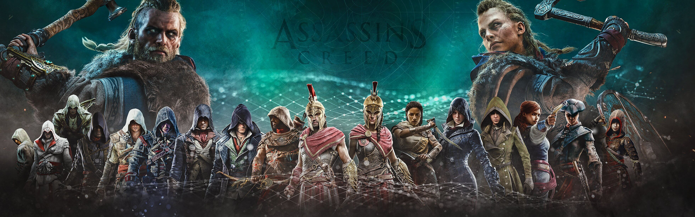

# Find The Assassins #

*Can you see where the assassins are?*



## Table of Content ## 
---
- [UX (User Experience)](#ux--user-experience-)
  * [Project Goals](#project-goals)
  * [User Goals](#user-goals)
  * [User Stories](#user-stories)
  * [Site Owner Goals](#site-owner-goals)
  * [User Requirements and Expectations](#user-requirements-and-expectations)
  * [Design Choices](#design-choices)
- [Wireframing](#wireframing)
- [Features](#features)
- [Technologies used](#technologies-used)
- [Testing](#testing)
- [Bugs](#bugs)
- [Deployment](#deployment)
- [Credits](#credits)


---
## UX (User Experience) ##


---
### Project Goals ###
A game to train your memory and have **fun** while doing it.

The goal for this project is to train the user's memory, using images from the well known game franchise [Assassin's Creed](https://www.ubisoft.com/en-us/game/assassins-creed) to create a more fun experience for the user. But also to make it a little harder, because multiple detailed pictures are a lot harder to remember than standard icons.


### User Goals ###
* Find out how good your memory is.
* Have fun with nostalgia. if you have played the games that is. 
* Improving your memory by trying to beat your own score.

### User Stories ###
* As a **user**, I want a well organised site that looks attractive.
* As a **user**, I want a site that loads properly and doesn't crash.
* As a **user**, I want to improve my score and time. So i can see the result the game has had on my memory.

### Site Owner Goals ###
* As a **site owner** I want to help my users improve their memory by trying to beat their own score.

### User Requirements and Expectations ###

**Requirements**

* Have an **intuitive** layout that is easy to use.
* **Recognizable** images from the main characters of the Assassin's Creed games.
* Having a clear target to improve on. (replay value)

**Expectations**
* Game is **easy** to use and gives **no errors**.
* Content is **appealing** 
* Game is a **challenge**, but not extremely **difficult**.

### Design Choices ###

When thinking about how to design the game, I didn't want to make something to difficult that doesn't have to be difficult.
Eventually I found [this tutorial](https://scotch.io/tutorials/how-to-build-a-memory-matching-game-in-javascript) and used it as the base for my game.

Later on in the project I found [this tutorial](https://medium.com/free-code-camp/vanilla-javascript-tutorial-build-a-memory-game-in-30-minutes-e542c4447eae).
There were similar design choices as in the first one I found. But it gave me some good ideas to expand on. 

**Fonts**

* The main font used across the game is [**Oswald**](https://fonts.google.com/specimen/Oswald?query=oswald).
* The fond used for the play again button on the congratulations modal is [**Gloria Hallelujah**](https://fonts.google.com/specimen/Gloria+Hallelujah?query=glo).
* for the title of the game I used a custom font called [assassin](https://www.dafont.com/assassin.font). This font is used for the title of the Assassin's creed games. So it fits very well.

**Icons**

**Icons** used were provided by [Font Awesome](https://fontawesome.com/), used in **moderation** and are self-explanatory.

**Colors**

Color choices are based on colors that are used a lot in the Assassin's Creed games.
* Black #000000
* Gold  #D4AF37	
* Red   #880808	
* White #FFFFFF
* Blue  #023ee4

[Color Scheme](assets/images/color-scheme.png)


## Wireframing ##


To make my **wireframes** I used [balsamiq](https://balsamiq.com/).

You can find my wireframes [here](https://github.com/ThomasMSmit/Memory-game/tree/master/wireframes).

Direct link to wireframes:

* [Desktop Wireframe](https://github.com/ThomasMSmit/Memory-game/blob/master/wireframes/Desktop%20Wireframes%20.pdf)
* [Tablet Wireframe](https://github.com/ThomasMSmit/Memory-game/blob/master/wireframes/Tablet%20Wireframes.pdf)
* [Mobile Wireframe](https://github.com/ThomasMSmit/Memory-game/blob/master/wireframes/Phone%20Wireframes.pdf)

## Features ##
---
**Features that have been implemented:**

* A challenging **memory game**.
* Ranking system that you can improve on.
* Images that fit the subject of the game to make it more **appealing**.

**Features** that have **NOT** been implemented:

* Reset button in score board. Which is visible in the wireframes.

**Explanation:** Due to time constraints i did not get the chance to implement this feature.


**Features** that will be **implemented** in the **future:**

* Reset button in the score board, for faster restarting.
* Better score system, possibly online against other people. 
* More picture combinations then just the main assassins from the game.
* Social media pages to interact with the community.


## Technologies used ##
---
**Languages**

* [HTML](https://developer.mozilla.org/en-US/docs/Web/HTML)
* [CSS](https://developer.mozilla.org/en-US/docs/Web/CSS)
* [JS](https://nl.wikipedia.org/wiki/JavaScript)


**Tools & Libraries**

* [Git](https://git-scm.com/)
* [Bootstrap](https://getbootstrap.com/)
* [Font-Awesome](https://fontawesome.com/icons?d=gallery)
* [Google fonts](https://fonts.google.com/)
* [Gimp](https://www.gimp.org/)
* [jQuery](https://jquery.com/)
* [Popper](https://popper.js.org/)
* [TinyPng](https://tinypng.com/)
* [HTML/CSS validator](https://validator.w3.org/)
* [JS validator](https://jshint.com/)


## Testing ##
---


* User story to be tested:
As a **user**, I want a well organised site that looks attractive. 
  
Tested layout and functionality on all screensizes and everything looks great and works as expected.


* User story to be tested:
As a **user**, I want a site that loads properly and doesn't crash.

Tested loading of the site and loads as expected and does not crash at any point.


* User story to be tested:
As a **user**, I want to improve my score and time. So i can see the result the game has had on my memory.

Tested the score system and timer. Works as expected and can be improved upon by the user.


* I had one friend test my game. And all the feedback was according to the user goals and stories I have written.


**Responsiveness**

* As the responsiveness did not work as intended at first, I decided to proceed with a mobile first approach and adjusted the CSS according to different screen sizes.


**Design**

* Everything looks according to the design also used by Ubisoft for the Assassin's creed franchise.


## Bugs ##
---

**During development**

[HTML validator](https://validator.w3.org/nu/)

 **Error:** (The element **a** must not appear as a descendant of the **button** element.)   
 
 **Description:** There were no noticable issues with this issue but after running it true the HTML vaalidator this error came up.

 **Fixed:** by deleting all **a** elements out of the **button** elements.

[CSS validator](https://jigsaw.w3.org/css-validator/)

 **Error:** (Value Error: visibility **show** is not a visibility value.) 
 
 **Description:** It did not bring forward any issues but in the .startoverlay class in CSS, the visibility value was set to **show** which is not a correct value for visibility.
 
 **Fixed:** by changing **show** to **visible**.


 **Error:** ( HTML, body	    Parse Error ??) 

 **Description:** Unnessesary use of class naming. Everything worked as intended after the fix was applied.

 **Fixed:** by deleting the **HTML, body** class and adding the values in it to the **body** class.


[JS hint ](https://jshint.com/)

 **Warnings:** Undivined variables and missing semicolons

 **Description:** Issues such as missing semicolon and undivined variables came up when checking code with JS hint.

 **Fixed:** by adding semicolons in the right places and giving the undivined varibles 


**DevTools**


 **Error:** ('backface-visibility' is not supported by Safari, iOS Safari. Add '-webkit-backface-visibility' to support Safari 5.1+, iOS Safari 5+.)

 **Description:** When checking for issues in DevTools this error came up.

 **Fixed** by adding **'-webkit-backface-visibility'** to backface styling in CSS file.


**Warning:** ('content-type' header charset value should be 'utf-8'.)

**Description:** When checking the DevTools for issues this warning came up.

**Not** able to fix warning due to it probably being a network issue which I can't fix.


**Warning:** ('content-type' header media type value should be 'image/x-icon', not 'image/vnd.microsoft.icon'.)

**Description:** When checking the DevTools for issues this warning came up.

**Not** able to fix warning due to it probably being a network issue which I can't fix.


**Error:** (A 'cache-control' header is missing or empty.)

**Description:** When checking the DevTools for issues this warning came up.

**Not** not able to fix error due to it probably being a network issue also.


## Deployment ##
---
This project is **developed** on **Gitpod**, using **git** and **GitHub** to host the repository. 


To deploy this repository using **GitHub Pages** the following steps were made:

* Opened up **GitHub** in the **browser**.
* Signed in using **username** and **password**.
* Selected my **repositories**.
* Navigated to **ThomasMSmit/Memory-game**.
* In the top navigation clicked **settings**.
* Clicked on the **Pages** tab on the left side of the screen.
* Selected **Master Branch** from the **Source** dropdown menu.
* Clicked to **confirm** my **selection**.
* Memory-game **live** on **GitHub Pages**.


**Running Memory-game Locally**

**Cloning** Memory-game from **GitHub**:

* Navigate to **ThomasMSmit/Memory-game**.
* Go to the **code dropdown box**.
* **Copy** the URL in the **dropdown box**.
* Using your **favorite IDE** open up your **preferred** terminal.
* **Navigate** to your **desired** file **location**.

**Copy** the following code and **input** it into your **terminal** to **clone Memory-game**.

```git clone https://github.com/ThomasMSmit/Memory-game```


## Credits ##
---

**Code credit**

* Thank you to [Sandra Israel-Ovirih](https://github.com/sandraisrael). Her project [Memory-Game-fend](https://github.com/sandraisrael/Memory-Game-fend) helped me to get my own project going. 

* Thank you to [Marina Ferreira](https://medium.com/@marina.ferreira.developer). Her [JavaScript tutorial](https://medium.com/free-code-camp/vanilla-javascript-tutorial-build-a-memory-game-in-30-minutes-e542c4447eae) for building a memory game really gave me a good base to start my project from.


**Images used**

[Images used for cards](http://wallpaperswide.com/assassins_creed-desktop-wallpapers.html)

[Assassin's creed logo](https://logos-world.net/assassins-creed-logo/)

[The-Brotherhood](https://www.reddit.com/r/assassinscreed/comments/k1qwbs/assassins_creed_wallpaper_works_with_dual_monitors/)


For generating a table of content: <small><i><a href='http://ecotrust-canada.github.io/markdown-toc/'>Table of contents generated with markdown-toc</a></i></small>


**Special thanks**

* Big thanks to Student care. Specifically Alexander, for giving me enough time to finish my project.

* A **BIG** thank you to [Aukje van der Wal](https://github.com/byIlsa) for helping me get back on track and showing me how you should tackle a project.

* A Thank you to Sean from Tutor support for helping me fix a couple issues I wasn't able to figure out by myself.


**Site for educational purposes only!**


